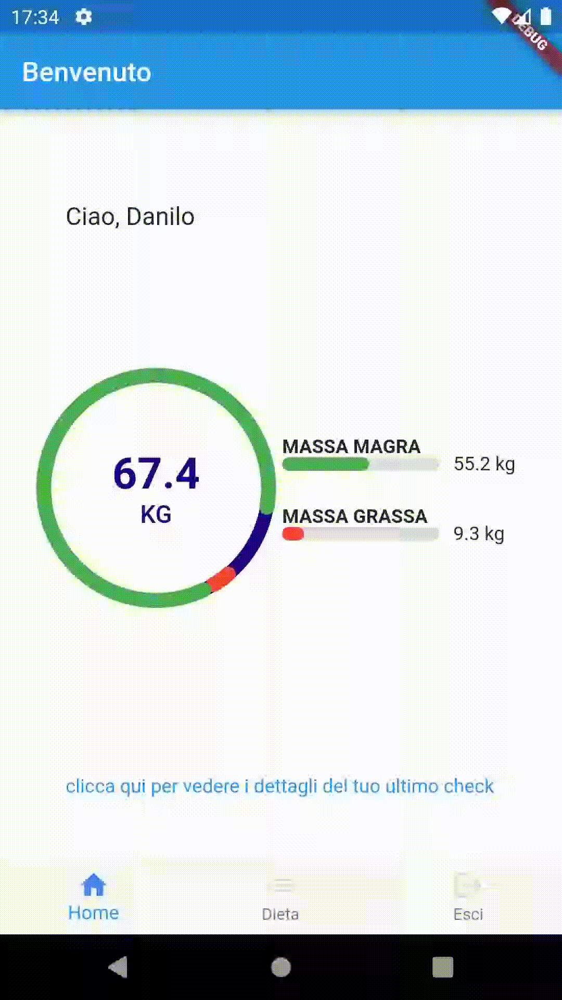
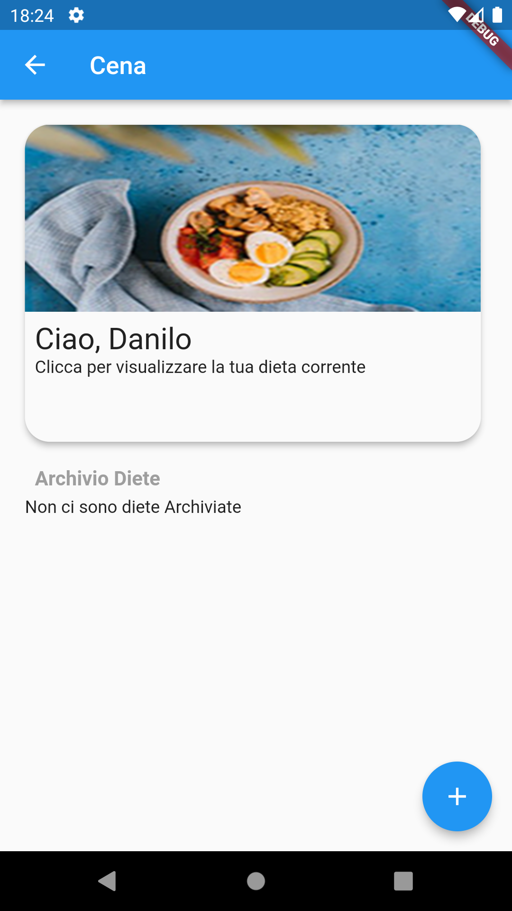

**Nome:** Danilo Rosati

**Matricola:** 310239

# Healty

Healty è un applicazione pensata per il rapporto tra nutrizionista e cliente.
In particolare, al cliente è permesso consultare la propria dieta e tenere traccia dell'analisi della composizione corporea.
Al nutrizionista sarà permesso inserire la dieta e i valori rilevati dal check con il cliente.

 
 

## Getting Started

This project is a starting point for a Flutter application.

A few resources to get you started if this is your first Flutter project:

- [Lab: Write your first Flutter app](https://flutter.dev/docs/get-started/codelab)
- [Cookbook: Useful Flutter samples](https://flutter.dev/docs/cookbook)

For help getting started with Flutter, view our
[online documentation](https://flutter.dev/docs), which offers tutorials,
samples, guidance on mobile development, and a full API reference.

 
 

### Credenziali

Per utilizzare l'applicazione è richiesta una coppia user/password.
Per il testing è possibile utilizzare un qualsiasi account già presente nel database:

|User|Password|Descrizione
| --------------------------- | ----------------- | ----------------- |
| Admin | Admin            | Nutrizionista 
| Danilo        | Danilo              | Cliente

 
 

### Casi d'uso e Interfaccia Utente

Durante il primo avvio all'utente è mostrata la **pagina di login**, qui è possibile inserire il proprio username e password. Nel caso i dati forniti non siano corretti è mostrato un messaggio d'errore altrimenti l'utente è trasportato nella pagina home e i suoi dati d'accesso sono salvati per la prossima volta.

    

Nella **Pagina Home** è possibile vedere i valori della propria composizione corporea relativi all'ultimo check effettuato con il nutrizionista

     
    

        
    

Premendo l'icona **Dieta** nella barra di navigazione inferiore l'utente atterra nella pagina dedicata alla propria dieta.
 
La pagina presenterà due Tab:
 - Dieta pranzo: dove verrà visualizzata la dieta corrente e, se c'è ne sono, la lista di quelle vecchie ormai archiviate.
   
 

 - Dieta cena: dove verrà visualizzata la dieta corrente e, se c'è ne sono, la lista di quelle vecchie ormai archiviate.
   

Al tap su una dieta, che sia corrente o archiviata, si aprirà il dettaglio:

 

Oppure, girando lo smartphone avendo una visuale landscape si visualizzerà il dettaglio della dieta corrente:

 

Premendo l'icona **Esci** verrà effettuato il logout dall'applicazione:

 

 
 

### Casi d'uso e Interfaccia Nutrizionista

Effettuando il login come **Nutrizionista** atterriamo sulla **Homepage** che presenterà la lista dei clienti e il relativo pulsante che permette la creazione di un nuovo utente:

 

La creazione di un nuovo utente porta verso il **form di compilazione dei dati**.
Qui il nutrizionista, attraverso un form a step, inserisce:
- i dati anagrafici del cliente
- username e password per l'accesso
- i dati provenienti dalla bioimpedenza

Terminato l'inserimento dei dati, viene mostrata una **pagina di riepilogo** che permette la modifica dei dati nel caso in cui fossero scorretti, oppure la conferma di creazione del nuovo cliente:

 

Al tap sul cliente, atterriamo nella **pagina di gestione del cliente**.

 

Dove sarà possibile:
1. visualizzare i dati anagrafici e i dati dell'analisi della composizione corporea relativi all'ultimo check:

 

Cliccando il tasto **Modifica** sarà possibile modificare i dati della composizione corporea con i nuovi dati provenienti dalla bioimpedenza.  
Nel caso in cui uno di questi campi risultasse vuoto viene mostrato un messaggio di errore. Altrimenti si prosegue con la modifica dei dati:

 

 

2. Visualizzare le diete create per pranzo, con la possibilità di crearne una nuova:

 

3. Visualiuzzare le diete create per cena, con la possibilità di crearne una nuova:

 

Nel caso in cui uno dei campi risultasse vuoto viene mostrato un messaggio di errore. Altrimenti si prosegue con la creazione delle dieta.
 
Quando viene creata una nuova dieta, nel caso ne fosse presente già una corrente, quest'ultima viene archiviata. In modo tale da poter presentare come dieta corrente quella più nuova.

 

Il procedimento di creazione di una dieta è il medesimo per il pranzo e la cena.
 

Il nutrizionista può eliminare un cliente effettuando uno swipe verso destra sul nome del cliente presente nella lista:

 

 
 

## Tecnologia

L'applicazione si appoggia su [restdb.io](), un database NoSQL che offre un API REST